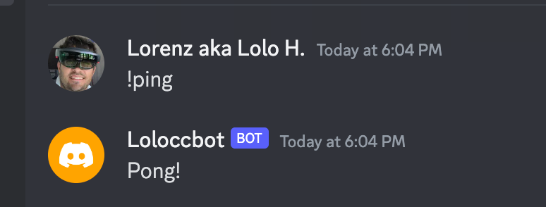

# Overview
I am implementing the Build Your Own Discort bot based on the coding challenge by https://codingchallenges.fyi/challenges/challenge-discord by John Cricket

# Language
I will use Java as I am gonna use Java again in my next job after having already experience for about 20 years but 'lost' a bit in C# in the last years.

## Template

reference the gradle library from https://github.com/Discord4J/example-projects/tree/master/gradle-simple-bot

But I am implementing it using the raw message detection as in example of main readme https://github.com/Discord4J/Discord4J#-quick-example

# Prepare

prepare your bot as described in the challenge and follow the instructions. https://codingchallenges.fyi/challenges/challenge-discord#step-zero

# Run

- install dist using gradle and run

```bash
./run.sh -t "<your discort bot token>" as documented in the challenge
```

and you should see




# Implementation

## Step 1

implement a simple bot and register a pluggable Cmd already to implement later different intents

```java
public interface Cmd {
    String commandPrefix();
    void onMessage(Message message, BotResponse response);
}
```

get the content from message and send back to response. I will add some more message-types. So far only String
