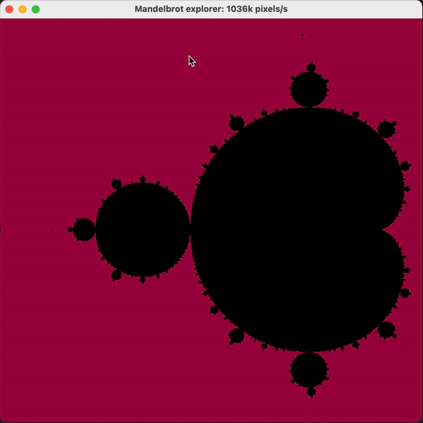

# Coding challenge for Build your own Mandelbrot Explorer

Since I heard about Mandelbrot sets in school back in the 80s, I was fascinated by the beautiful and complex patterns they create.

I have implemented at that time only low resolution mandelbot sets in modula-2 with a depth of 100. Floating point calculations were not that fast back then, so the results were not very detailed. I had to simulate it using decimal precision arithmetic.

see https://en.wikipedia.org/wiki/Mandelbrot_set

I have always wanted to create a Mandelbrot set explorer that allows users to interactively explore the set, zoom in and out, and adjust rendering parameters.


# Problem Statement

Write an application that allows users to explore the Mandelbrot set interactively. The application should render the Mandelbrot set, support zooming and panning, and allow users to adjust rendering parameters such as iteration depth and color schemes.
For debugging purposes, the application should also provide a command line interface to render the Mandelbrot set with specified parameters via console. 

technical difficulties:
- calculate in parallel using lightweight threads
- rendering should be fast enough to allow interactive exploration
- choose proper color, depth, and resolution to create visually appealing images
- use only pure java classes, no external libraries for rendering or complex number calculations

# Result



# Development

## Requirements

- java >= 21
- gradle
- some 3rd party libraries
  - lombok for builder pattern
  - picocli for command line interface
  - junit for unit tests
- pure java classes

## Build

```bash
gradle installDist
```

## Solution

Java implementation of the Mandelbrot set explorer. Just clicking on the image will zoom in, clicking with the right mouse button will zoom out.
The color scheme is backed in the code also the default position and zoom level.

- you can control the rendering parameters via command line interface
- you can run a UI to explore the Mandelbrot set interactively or to the console.

# Command line

```bash
 ./mandelbrot.sh -h
Usage: mandelbrot [-cghvV] [-vv] [-i=<maxIterations>] [-o=<outputFileName>]
                  [-w=<width>]
This challenge is to build your own application layer load balancer
  -c                     console output - default false
  -g                     GUI output - default true
  -h, --help             Show this help message and exit.
  -i=<maxIterations>     max iterations - default 1000
  -o=<outputFileName>    outpuf file name - default mandelbrot.png
  -v                     verbose model level 1
  -V, --version          Print version information and exit.
      -vv                verbose model level 2
  -w=<width>             width in pixel - default 100px if terminal out, 1000px
                           if GUI out
```

## Graphical User Interface

```bash
 ./mandelbrot.sh -g
```

- you can click on the image to zoom in
- you can click with the right mouse button to zoom out
- choose parameters -w width and -i maxIterations

## Console output

```bash
./mandelbrot.sh -c -w 100 -i 500
```

```text
....................................................................''..............................
.....................................................................'''............................
.....................................................................''''...........................
......................................................................''`''''''.....................
......................................................................''`''',`......................
.....................................................................''''`''''......................
....................................................................'''`'``'''......................
.................................................................''`'''`I  `''''....................
.................................................................`^,`'":- :``'``'...................
................................................................'''`,       ("`''...................
................................................................'''`"        :'''...................
...............................................................''''`l        \`''''.................
.......................................................'.....''''''-,        i''''''................
..................................................','"l'''''';^''"'``^      ```'``''`'''.....'''....
..................................................''`,`''''',^l`^i^"u-       c^I!:'`"^'''''''' '....
..................................................''',   "`:""                       ``'''```'^"'...
..................................................''"`    `;                         1 `'lw:"I^^'...
................................................'''''`,                                      ^''....
...............................................''''''``:                                     ;"'....
..............................................'`_^II^-                                     w`'''....
.............................................''^"i !!                                       X`,''...
.....................'^''.......''.........''''''`"                                          _'''''.
.....................'`'''....''''''......'''''"`1                                            ``"'^'
.....................'`'''''''''`^'''''''''''''i                                                 ^'.
.....................'''',```'''`^^'"`''''''''~`                                               {"''.
.....................''''`;  ``:^  ^^;`^''''''^                                                ['''.
.....................'''^^X  "        "^``''':                                                 ^"''.
...................''^'``;               :```,                                                 ~:'..
...............'''''''`,l                 M``,                                                 ^''..
..............''''''''`"                    ^                                                  ''...
.............'''`'':'``,                    "                                                  ^'...
............'''''^   \^                                                                      I''....
'..''''''''''''``i    c                                                                     +''.....
('''''''''''````il                                                                         `'''.....
'..''''''''''''``i    c                                                                     +''.....
.............'''`^`:```                                                                       `'....
.............'''`'':'``,                    "                                                  ^'...
..............'`'''''''`                   ;`!                                                  "'..
...............'''''''`,l                 M``,                                                 ^''..
.....................''''`^             ^^'''`:                                                  ,'.
.....................'''^^X  "        "^``''':                                                 ^"''.
.....................''''`^";```^I:``^''''''''-                                                `'''.
.....................'''',```'''`^^'"`''''''''~`                                               {"''.
.....................^`'''''''''`''''''''''''':! O                                            ! ~``'
.....................'`'''....''''''......'''''"`1                                            ``"'^'
.....................''.....................''''`"                                           !i''''.
.............................................''^"i !!                                       X`,''...
..............................................'''^''~]                                    : ^'''....
...............................................''''''``:                                     ;"'....
.................................................'''I:                                 :`    :`''...
..................................................''"`    `;                         1 `'lw:"I^^'...
..................................................'```""l"''`X "B                z^  `''''''''`''...
..................................................''`,`''''',^l`^i^"u-       c^I!:'`"^'''''''' '....
..................................................'`''``''''''''''''`       i`''''''`'.......'`'....
.......................................................'.....''''''-,        i''''''................
...............................................................'''`,         ",'''..................
................................................................'''`"        :'''...................
................................................................'''`^^:    :,`^`'...................
.................................................................`^,`'":- :``'``'...................
...................................................................''''"`I`;'''.....................
....................................................................'''`'``'''......................
.....................................................................''''`^'''......................
......................................................................''`''',`......................
......................................................................' ''...'......................
.....................................................................''''...........................
.....................................................................'''............................
....................................................................''..............................
```

# Technical implementation details

## Virtual threads in java

we are comparing the first rendering and calculte the number of pixels / s.

start: -w 1000 -i 10000

you can see speed in the title bar of the window and the console output.

```bash

Optimizing 1: 
- caching color values for each pixel to avoid recalculating the color for the same pixel multiple times
- 2'008'000 pixels / s

Optimizing 2:
- Executors.newFixedThreadPool(Runtime.getRuntime().availableProcessors()
- 2'180'000 pixels / s

Optimizing 3:
- executor.submit(() per row
- 8'400'000 pixels / s

Optimizing 4:
- IntStream.range(0, width).parallel().forEach(row
- 7'400'000 pixels / s

Optimizing 5:
- back to Optimizing 3
- do not calculate with 0.0 in mandelbrot calculation and do while
- 8'680'000 pixels / s