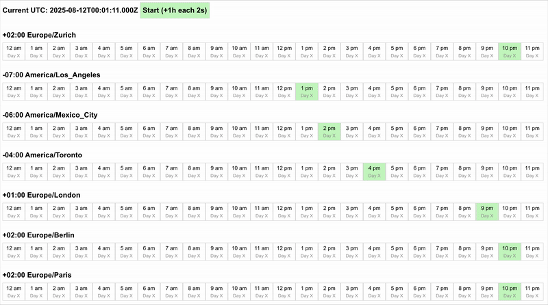

# Coding challenge for Build your own time zone converter

I am implementing the foundation for time zone conversion.
based on https://codingchallenges.fyi/challenges/timezone-converter
by John Crickett

# Problem Statement
Write an API that converts a given source time zone into multiple target time zones. The API should accept a date and time in the source time zone and return the equivalent date and time in the target time zones.
The API should be able to handle daylight saving time changes and other time zone rules.

# Development

## Requirements

- java 21
- gradle 
- some 3rd party libraries
  - lombok for builder pattern
  - unit test for 
  - picocli for command line interface
  - spark for web server
  - gson for json parsing
- pure java classes 

## Build

```bash
gradle installDist
```

## Solution 

Java own implementation for timezones. 
- implemented a simple command line for the convertion (source, targets - cities, countries, timezones)
- implemented a REST API to convert timezones
- implemented a simple UI to show multiple time zones (and simulate a clock every 2s)

### Command line

Calculates the timezones based on the source timezone and the target timezones.
- source timezone can be a city name, country code or timezone name
- the target timezones can be specified as a list of cities, countries or timezones

```bash
./timezone.sh -s=America/New_York -c=Europe/Zurich,America/Los_Angeles
```
Response json
```json
[
  {
    "source_time": "2025-08-11T16:35:22.011884Z",
    "source_offset": "-04:00",
    "target_0_id": "America/Los_Angeles",
    "target_0_time": "2025-08-11T13:35:22.011884Z",
    "target_0_offset_to_utc": "-07:00",
    "target_0_offset_to_source": "-03:00",
    "target_1_id": "Europe/Zurich",
    "target_1_time": "2025-08-11T22:35:22.011884Z",
    "target_1_offset_to_utc": "+02:00",
    "target_1_offset_to_source": "+06:00",
    "source_id": "America/New_York"
  }
]
```

### API

The API is implemented using Spark Java and Gson for JSON parsing. It exposes a single endpoint to convert timezones.
You can pass
- an optional timestamp in UTC (optional, default is current time)
- an optional "hours" parameter to add from the UTC time (optional, default is 8)
- body parameters:
  - source: the source timezone (required)
  - timezones: a list of target timezones based on timezone names (optional - 1st priority)
  - cities: a list of target timezones based on city names (optional - 2nd priority)
  - countries: a list of target timezones based on country codes (optional - 3rd priority)

```curl
curl -X POST http://localhost:4567/timezone-converter?utc=2025-08-01T08:00:00Z&hours=8 \
-H "Content-Type: application/json" \
-d '{
    "source": "America/New_York",
    "cities": ["Europe/Zurich", "America/Los_Angeles"]
}'
```
Response
```json
[
  {
    "source_id": "America/New_York",
    "source_time": "2025-08-01T04:00:00Z",
    "source_offset": "-04:00",

    "target_0_id": "America/Los_Angeles",
    "target_0_time": "2025-08-01T01:00:00Z",
    "target_0_offset_to_utc": "-07:00",
    "target_0_offset_to_source": "-03:00",

    "target_1_id": "Europe/Zurich",
    "target_1_time": "2025-08-01T10:00:00Z",
    "target_1_offset_to_utc": "+02:00",
    "target_1_offset_to_source": "+06:00"
  }
]
```

### UI

The UI has some predefined timezones, which can be selected. Edit not supported yet.


with a short animation of the clock ticking every 2 seconds

# Run

## Command line
```bash
./timezone.sh -h
Usage: timezone [-hvV] [-vv] [-s=<sourceTimezone>] [-c
                [=<targetTimezoneCities>...]] [--cc
                [=<targetTimezoneCountries>...]] [-t[=<targetTimezones>...]]
This challenge is to build your own timezone converter
  -c=[<targetTimezoneCities>...]
                         set target timezone abbreviations based on a city name
                           separated by ,
      --cc[=<targetTimezoneCountries>...]
                         set target timezone country based separated by ,
  -h, --help             Show this help message and exit.
  -s=<sourceTimezone>    set source timezone abbreviation. default is current
                           timezone is Europe/Zurich
  -t=[<targetTimezones>...]
                         set target timezone abbreviations separated by ,
  -v                     verbose model level 1
  -V, --version          Print version information and exit.
      -vv                verbose model level 2
```

## Example

### Command line using city names (timezone name)
```bash
./timezone.sh -s=America/New_York -t=Europe/Zurich
```

### Command line using country names (timezone name)
```bash
./timezone.sh -s=America/New_York --cc=DE
```

it will calculate the timezone based on the country code in ISO 3166-1 alpha-2 format.
It could get multiple timezones countries, separated by a comma.

### Command line using city names (timezone abbreviation)
```bash
./timezone.sh -s=America/New_York -c=Zurich
```

the citynames are seperated by a comma, case insensitive

## Web service
if no country,  city or timezone is specified, then  an timezone APi is exposed

POST /timezone-converter
```json
{
  "source": "Europe/Zurich",
  "countries": [
    "US"
  ]
}
```


### Order

the order of the command line parameters is important.
- search for cities first
- search for countries
- search for timezones

# TODO

- impl better return values