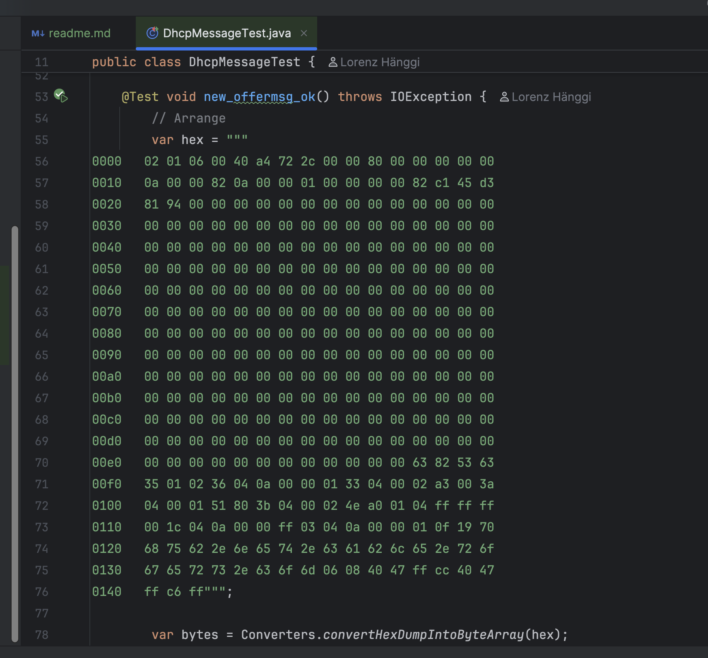
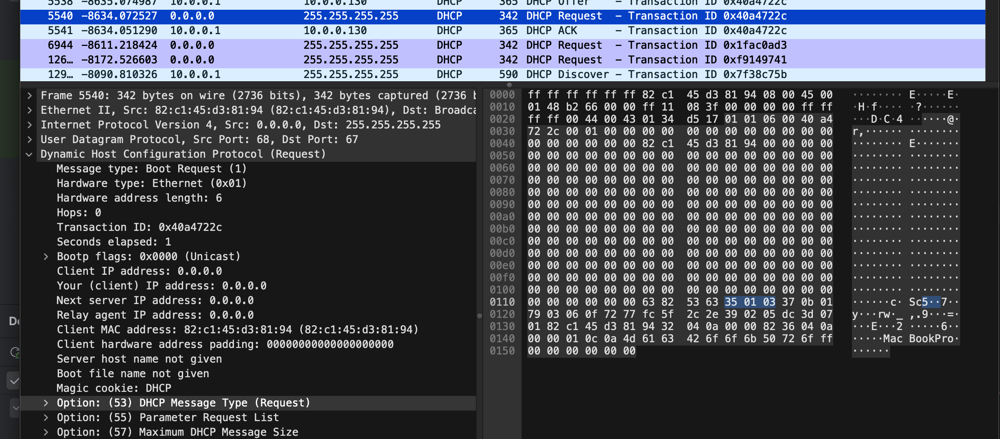

# Coding challenge - DHCP client in java

based on the coding challenge from https://codingchallenges.substack.com/p/coding-challenge-94-dhcp-client by John Cricket.
This project provides a Java implementation for DHCP client (Dynamic Host Configuration Protocol) functionality.

## Project Structure

- `app/src/main/java/dhcp/`  
  Contains the main source code for DHCP operations, including packet handling, server/client logic, and utility classes.

## Features

- DHCP packet parsing and construction
- DHCP server and client implementation (no releasing of IP addresses yet)
- Logging and error handling
- use PicoCLI for command line parsing
- Unit tests for core functionality including with hex testing data from Wireshark real DHCP packets

## Restrictions

I have not fully implemented all DHCP options within the scope of this challenge. They are defined in the Enumeration.
I have analyzed the DHCP packets from wireshark based on real requests and implemented the core functionality to discover, request, and acknowledge IP addresses. 
The focus is on demonstrating the basic DHCP client operations.

## Requirements

- Java 8 or higher
- Gradle

## Build

To build the project:

```sh
./gradlew build

## Run

```bash
./dhcp.sh -v
Starting DHCP process...

[1 DISCOVER] Sent DHCPDISCOVER broadcast to server.
[2 OFFER] Received DHCPOFFER from server: 10.0.0.1
[2 OFFER] Received DHCPOFFER for IP: /10.0.0.131
[3 REQUEST] Sent DHCPREQUEST for IP: /10.0.0.131
[4 ACK] DHCPACK received. Lease IP: /10.0.0.131
Stopping DHCP process...
DHCP Client started with the following configuration:
Server IP: /10.0.0.1
Client IP: /10.0.0.131
```


### Options

```bash
Usage: dhcp-client [-hvV] [-vv] [-n=<networkInterfaceName>]
This challenge is to build your own DHCP client application
  -h, --help      Show this help message and exit.
  -n=<networkInterfaceName>
                  network interface to use. default en0
  -v              verbose model level 1
  -V, --version   Print version information and exit.
      -vv         verbose model level 2
```

## Testing

I have included unit tests for the core functionality. To run the tests, use:

```sh
./gradlew test
```

I am  using a hex file with real DHCP packets captured by Wireshark for testing purposes. The test cases cover various scenarios including packet parsing, construction, and client-server interactions.


# License

This project is licensed under the MIT License. See the LICENSE file for details.

# Acknowledgments
- John Cricket for the original challenge idea.
- The open-source community for libraries and tools used in this project.
- The developers of Wireshark for providing valuable packet analysis tools.
  
